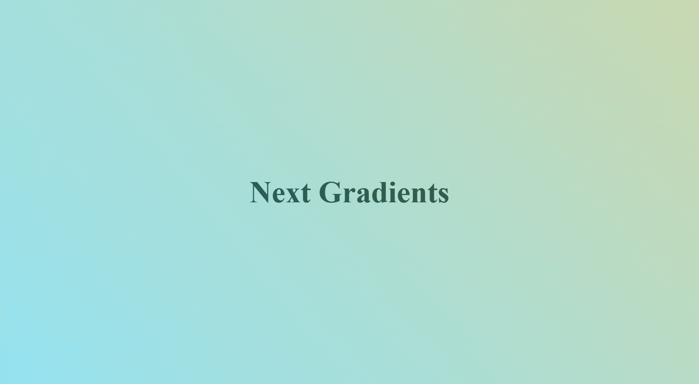

# Next Gradients

[](.)

---

[](https://www.npmjs.com/package/next-gradients)

## Description

Package of components and utilities for creating complex and animated gradients for Next.js apps.

## Features

- Random gradient generation

## Installation

You can install this package via npm:

```bash
npm i next-gradients
```

## Usage

The components can be used either on the `app/` or `pages/` directories. Here’s a basic example:

```javascript
import { RandomGradient } from 'next-gradients';

// This page will 
export default function page() {
    return (
        <RandomGradient>
            <!-- ...other elements -->
        </RandomGradient>
    )
}
```

## Contributing

If you’d like to contribute to this project, please follow these guidelines:

1. Fork the repository.
2. Create a new branch (`git checkout -b feature-branch`).
3. Make your changes.
4. Commit your changes (`git commit -am 'Add new feature'`).
5. Push to the branch (`git push origin feature-branch`).
6. Create a new Pull Request.

## License

This project is licensed under the MIT License - see the [LICENSE](https://opensource.org/license/mit) file for details.

## Acknowledgments

- Inspiration
- References

---
